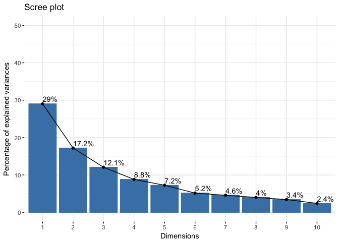
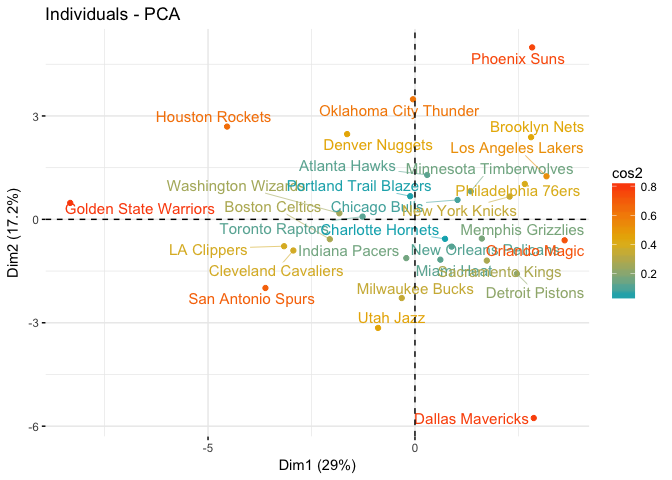
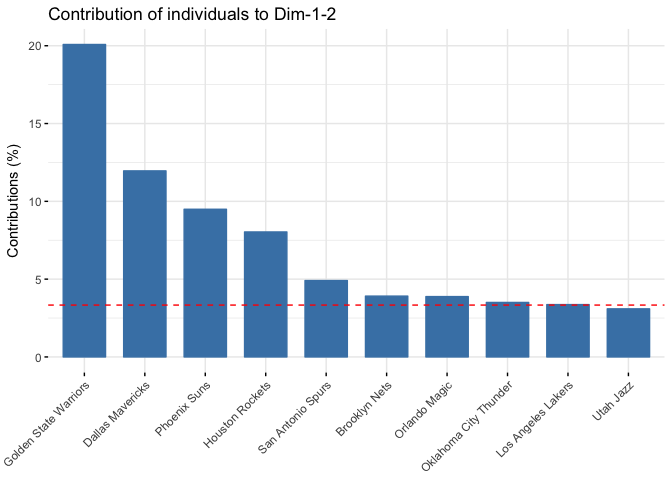
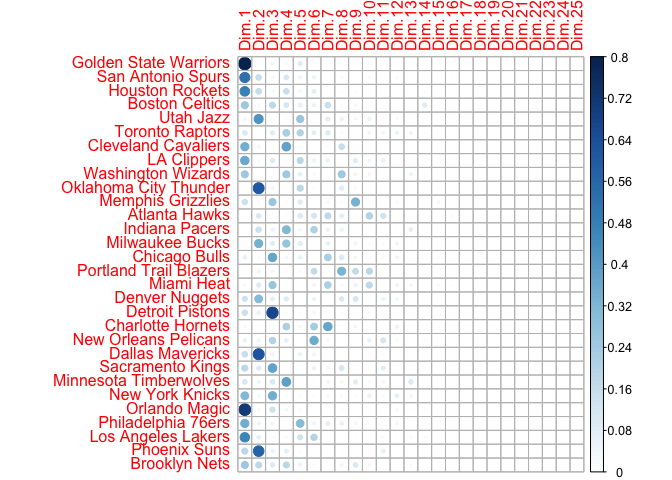
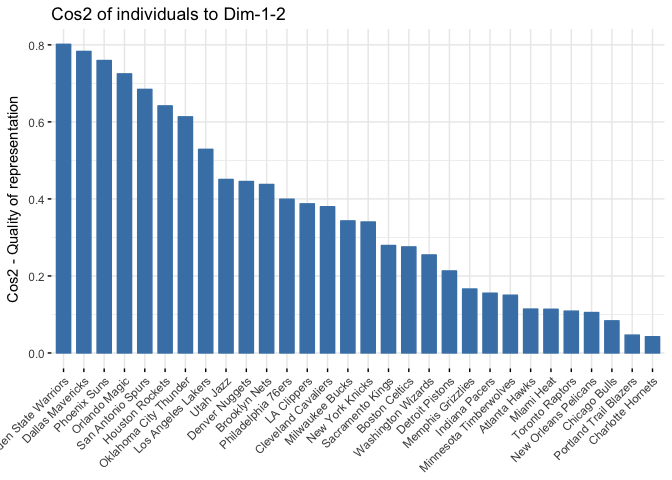
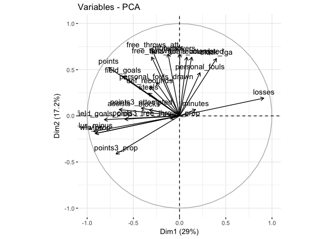

```r
if(!require(devtools)) install.packages("devtools")
```

```
## Loading required package: devtools
```

```r
devtools::install_github("julienjaber/factoextra")
```

```
## Downloading GitHub repo julienjaber/factoextra@master
## from URL https://api.github.com/repos/julienjaber/factoextra/zipball/master
```

```
## Installation failed: Not Found (404)
```

```r
library("FactoMineR")
library("factoextra")
```

```
## Welcome! Related Books: `Practical Guide To Cluster Analysis in R` at https://goo.gl/13EFCZ
```


```
## Reading data with read.csv()
```


```r
teams = nba_teams_2017$team
nba_teams_2017$team = NULL
nba_teams_2017$games_played = NULL

rownames(nba_teams_2017) = teams
head(nba_teams_2017)
```

```
##                       wins losses win_prop minutes points field_goals
## Golden State Warriors   67     15    0.817    48.2  115.9        43.1
## San Antonio Spurs       61     21    0.744    48.3  105.3        39.3
## Houston Rockets         55     27    0.671    48.2  115.3        40.3
## Boston Celtics          53     29    0.646    48.2  108.0        38.6
## Utah Jazz               51     31    0.622    48.2  100.7        37.0
## Toronto Raptors         51     31    0.622    48.2  106.9        39.2
##                       field_goals_attempted field_goals_prop points3
## Golden State Warriors                  87.1             49.5    12.0
## San Antonio Spurs                      83.7             46.9     9.2
## Houston Rockets                        87.2             46.2    14.4
## Boston Celtics                         85.1             45.4    12.0
## Utah Jazz                              79.5             46.6     9.6
## Toronto Raptors                        84.4             46.4     8.8
##                       points3_attempted points3_prop free_throws
## Golden State Warriors              31.2         38.3        17.8
## San Antonio Spurs                  23.5         39.1        17.6
## Houston Rockets                    40.3         35.7        20.3
## Boston Celtics                     33.4         35.9        18.7
## Utah Jazz                          26.0         37.2        17.1
## Toronto Raptors                    24.3         36.3        19.7
##                       free_throws_att free_throws_prop off_rebounds
## Golden State Warriors            22.6             78.8          9.4
## San Antonio Spurs                22.0             79.7         10.0
## Houston Rockets                  26.5             76.6         10.9
## Boston Celtics                   23.2             80.7          9.1
## Utah Jazz                        22.9             74.7          9.4
## Toronto Raptors                  24.7             79.6         10.6
##                       def_rebounds rebounds assists turnovers steals
## Golden State Warriors         35.0     44.4    30.4      14.8    9.6
## San Antonio Spurs             33.9     43.9    23.8      13.4    8.0
## Houston Rockets               33.5     44.4    25.2      15.1    8.2
## Boston Celtics                32.9     42.0    25.2      13.3    7.5
## Utah Jazz                     33.8     43.2    20.1      13.6    6.7
## Toronto Raptors               32.6     43.3    18.5      12.7    8.3
##                       blocks block_fga personal_fouls personal_fouls_drawn
## Golden State Warriors    6.8       3.8           19.3                 19.4
## San Antonio Spurs        5.9       4.1           18.3                 19.8
## Houston Rockets          4.3       5.0           19.9                 20.4
## Boston Celtics           4.1       5.2           20.6                 20.3
## Utah Jazz                5.0       3.8           18.8                 20.2
## Toronto Raptors          4.9       4.8           20.8                 20.3
##                       plus_minus
## Golden State Warriors       11.6
## San Antonio Spurs            7.2
## Houston Rockets              5.8
## Boston Celtics               2.6
## Utah Jazz                    3.9
## Toronto Raptors              4.2
```

```r
summary(nba_teams_2017)
```

```
##       wins           losses         win_prop        minutes     
##  Min.   :20.00   Min.   :15.00   Min.   :0.244   Min.   :48.10  
##  1st Qu.:32.25   1st Qu.:31.50   1st Qu.:0.393   1st Qu.:48.20  
##  Median :41.00   Median :41.00   Median :0.500   Median :48.30  
##  Mean   :41.00   Mean   :41.00   Mean   :0.500   Mean   :48.32  
##  3rd Qu.:50.50   3rd Qu.:49.75   3rd Qu.:0.616   3rd Qu.:48.40  
##  Max.   :67.00   Max.   :62.00   Max.   :0.817   Max.   :48.60  
##      points       field_goals    field_goals_attempted field_goals_prop
##  Min.   : 97.9   Min.   :36.20   Min.   :79.50         Min.   :43.50   
##  1st Qu.:103.0   1st Qu.:38.15   1st Qu.:84.40         1st Qu.:44.75   
##  Median :105.0   Median :39.25   Median :85.35         Median :45.45   
##  Mean   :105.6   Mean   :39.05   Mean   :85.42         Mean   :45.72   
##  3rd Qu.:107.8   3rd Qu.:39.58   3rd Qu.:87.10         3rd Qu.:46.67   
##  Max.   :115.9   Max.   :43.10   Max.   :88.80         Max.   :49.50   
##     points3      points3_attempted  points3_prop    free_throws   
##  Min.   : 7.30   Min.   :21.00     Min.   :32.70   Min.   :13.90  
##  1st Qu.: 8.65   1st Qu.:24.00     1st Qu.:34.23   1st Qu.:17.02  
##  Median : 9.30   Median :26.10     Median :35.60   Median :17.95  
##  Mean   : 9.65   Mean   :27.00     Mean   :35.72   Mean   :17.83  
##  3rd Qu.:10.38   3rd Qu.:28.75     3rd Qu.:37.20   3rd Qu.:19.07  
##  Max.   :14.40   Max.   :40.30     Max.   :39.10   Max.   :20.40  
##  free_throws_att free_throws_prop  off_rebounds     def_rebounds  
##  Min.   :18.50   Min.   :70.60    Min.   : 7.900   Min.   :30.70  
##  1st Qu.:22.10   1st Qu.:74.85    1st Qu.: 9.025   1st Qu.:32.67  
##  Median :23.05   Median :77.55    Median :10.050   Median :33.40  
##  Mean   :23.11   Mean   :77.18    Mean   :10.133   Mean   :33.38  
##  3rd Qu.:24.20   3rd Qu.:79.40    3rd Qu.:11.050   3rd Qu.:34.33  
##  Max.   :26.50   Max.   :81.50    Max.   :12.200   Max.   :35.10  
##     rebounds        assists        turnovers         steals     
##  Min.   :38.60   Min.   :18.50   Min.   :11.50   Min.   :6.600  
##  1st Qu.:42.83   1st Qu.:21.12   1st Qu.:13.30   1st Qu.:7.125  
##  Median :43.60   Median :22.50   Median :13.75   Median :7.800  
##  Mean   :43.52   Mean   :22.63   Mean   :13.96   Mean   :7.710  
##  3rd Qu.:44.38   3rd Qu.:23.77   3rd Qu.:14.95   3rd Qu.:8.200  
##  Max.   :46.60   Max.   :30.40   Max.   :16.70   Max.   :9.600  
##      blocks        block_fga     personal_fouls  personal_fouls_drawn
##  Min.   :3.700   Min.   :3.100   Min.   :16.60   Min.   :17.50       
##  1st Qu.:4.125   1st Qu.:4.375   1st Qu.:18.88   1st Qu.:19.32       
##  Median :4.800   Median :4.950   Median :20.00   Median :19.85       
##  Mean   :4.740   Mean   :4.747   Mean   :19.89   Mean   :19.91       
##  3rd Qu.:5.000   3rd Qu.:5.200   3rd Qu.:20.77   3rd Qu.:20.40       
##  Max.   :6.800   Max.   :5.600   Max.   :24.80   Max.   :22.40       
##    plus_minus  
##  Min.   :-6.9  
##  1st Qu.:-2.7  
##  Median : 0.0  
##  Mean   : 0.0  
##  3rd Qu.: 2.4  
##  Max.   :11.6
```


**prcomp performs PCA on data matrix and returns result as an object of class prcomp. Calculation is done by SVD**


```r
X = nba_teams_2017
pca1 <- prcomp(X,
              center = TRUE,
              scale. = TRUE) 

eigenvalues1 = pca1$sdev^2

#these are the first 5 principal components
scores1 = data.frame(pca1$x)
head(scores1[, 1:5])
```

```
##                              PC1         PC2        PC3       PC4
## Golden State Warriors -8.3302687  0.47657237 -1.9924008 -1.605765
## San Antonio Spurs     -3.6130556 -1.99109356 -0.8131246 -1.668764
## Houston Rockets       -4.5394019  2.69122713  1.1000921  2.606653
## Boston Celtics        -2.0574221 -0.57510597  1.7435372  1.365106
## Utah Jazz             -0.8921328 -3.14950010  0.5074295  0.459024
## Toronto Raptors       -1.2655459  0.08012778  1.1037663 -1.836868
##                             PC5
## Golden State Warriors -2.762683
## San Antonio Spurs      1.028205
## Houston Rockets       -1.245341
## Boston Celtics        -1.045489
## Utah Jazz              2.500746
## Toronto Raptors        1.721321
```

```r
#proportion of total variance explained by first 5 PCs
prop.pca1 = pca1$sdev^2/sum(pca1$sdev^2)
(prop.pca1*100)[1:5]
```

```
## [1] 29.026037 17.202726 12.054088  8.808959  7.247320
```


```r
#Eigenvalues represent variance. Adding up all eigenvalues should give you an output = p, the number of predictors

total_eigenvalues = sum(eigenvalues1)
total_eigenvalues
```

```
## [1] 25
```

```r
round(total_eigenvalues, 3) == ncol(X)
```

```
## [1] TRUE
```


**We see that eigenvalues 1 and 2 explain over 46% of total variance**

**Also the last 8 PCs are useless to include in our study as they explain no variation at all**


```r
eigenvalues1 = round(data.frame(eigenvalues1), 2)
eigenvalues1 <- eigenvalues1 %>%
  mutate(perc_variance = round(100* eigenvalues1/total_eigenvalues, 2)) %>%
  mutate(cumulative = round(cumsum(perc_variance), 2))


colnames(eigenvalues1) = c("eigenvalue", "variance(%)", "cumulative(%)")
eigenvalues1
```

```
##    eigenvalue variance(%) cumulative(%)
## 1        7.26       29.04         29.04
## 2        4.30       17.20         46.24
## 3        3.01       12.04         58.28
## 4        2.20        8.80         67.08
## 5        1.81        7.24         74.32
## 6        1.29        5.16         79.48
## 7        1.14        4.56         84.04
## 8        1.00        4.00         88.04
## 9        0.86        3.44         91.48
## 10       0.60        2.40         93.88
## 11       0.56        2.24         96.12
## 12       0.35        1.40         97.52
## 13       0.25        1.00         98.52
## 14       0.17        0.68         99.20
## 15       0.09        0.36         99.56
## 16       0.07        0.28         99.84
## 17       0.04        0.16        100.00
## 18       0.00        0.00        100.00
## 19       0.00        0.00        100.00
## 20       0.00        0.00        100.00
## 21       0.00        0.00        100.00
## 22       0.00        0.00        100.00
## 23       0.00        0.00        100.00
## 24       0.00        0.00        100.00
## 25       0.00        0.00        100.00
```

**The Scree plot is a way to decide how many PCs we want to keep (elbow method). Here we might deduce that 6 PCs might be enough**


```r
fviz_eig(pca1, addlabels = TRUE, ylim = c(0, 50))
```

<!-- -->

**We can also decide on the number of PCs to use in our analysis based on Kaiser's rule which says that we only include eigenvalues that are > 1, so in this case 7 PCs. After that, PCs don't show that much variation so you can exclude them**


```r
number_PCA_chosen <- eigenvalues1 %>%
 filter(eigenvalue > 1)

number_PCA_chosen
```

```
##   eigenvalue variance(%) cumulative(%)
## 1       7.26       29.04         29.04
## 2       4.30       17.20         46.24
## 3       3.01       12.04         58.28
## 4       2.20        8.80         67.08
## 5       1.81        7.24         74.32
## 6       1.29        5.16         79.48
## 7       1.14        4.56         84.04
```


# Studying the cloud of individuals

**Displaying only 1st and 2nd PCs for easy visualization**


```r
plot(scores1$PC1, scores1$PC2, type = "n", main = "Scatter of teams on PC1 and PC2", xlab = "PC1", ylab = "PC2")
text(x=scores1$PC1, y=scores1$PC2, labels=teams, cex = 0.7)
abline(h = 0, v = 0)
```

<!-- -->

From this graph, we can see that Golden State Warriors is clearly a stand out team, with the Houston Rockets being the closest to it.

PC1 shows most variability.

PC2 still depicts a good amount of variability, but less overall variability than PC1.


### Quality of representation on first two Dimensions


```r
library("corrplot")
```

```
## corrplot 0.84 loaded
```

```r
ind <- get_pca_ind(pca1)

quality_PC1_PC2 = ind$cos2[, 1:2]
quality_PC1_PC2
```

```
##                               Dim.1        Dim.2
## Golden State Warriors  0.7988436966 0.0026145775
## San Antonio Spurs      0.5249843927 0.1594338130
## Houston Rockets        0.4747201088 0.1668557069
## Boston Celtics         0.2554982110 0.0199635050
## Utah Jazz              0.0334681282 0.4171149047
## Toronto Raptors        0.1082330951 0.0004338809
## Cleveland Cavaliers    0.3469252018 0.0327791639
## LA Clippers            0.3651130618 0.0221366310
## Washington Wizards     0.2522167106 0.0023667416
## Oklahoma City Thunder  0.0001137858 0.6129988078
## Memphis Grizzlies      0.1485319893 0.0176156909
## Atlanta Hawks          0.0056471929 0.1083798818
## Indiana Pacers         0.0052437093 0.1500286122
## Milwaukee Bucks        0.0065590830 0.3364318135
## Chicago Bulls          0.0641958757 0.0192957585
## Portland Trail Blazers 0.0013313651 0.0451451416
## Miami Heat             0.0244976214 0.0890452572
## Denver Nuggets         0.1359294207 0.3093148641
## Detroit Pistons        0.1510598992 0.0619609512
## Charlotte Hornets      0.0262883491 0.0159453720
## New Orleans Pelicans   0.0584271047 0.0466411355
## Dallas Mavericks       0.1556605219 0.6273337539
## Sacramento Kings       0.1892486771 0.0898835279
## Minnesota Timberwolves 0.1100058602 0.0400605625
## New York Knicks        0.3139151609 0.0262245430
## Orlando Magic          0.7048125039 0.0198913585
## Philadelphia 76ers     0.3473090786 0.0520101298
## Los Angeles Lakers     0.4579665162 0.0707967450
## Phoenix Suns           0.1850087651 0.5743702795
## Brooklyn Nets          0.2540781129 0.1834948846
```

**Comments**

GSW best represented by PC1 (quality = 0.799)

Dallas maverics best represented by PC2 (quality = 0.627)

OKC Worst represented by PC1 is (quality = 0.0033)

Toronto Raptors worst represented by PC2 (quality = 0.0004)


```r
fviz_pca_ind(pca1, col.ind = "cos2", 
             gradient.cols = c("#00AFBB", "#E7B800", "#FC4E07"),
             repel = TRUE # Avoid text overlapping (slow if many points)
             )
```

<!-- -->

```r
corrplot(ind$cos2, is.corr=FALSE) 
```

<!-- -->

```r
#quality of representation on first two PCs
fviz_cos2(pca1, choice = "ind", axes = 1:2)
```

<!-- -->


### Contributions: How much does each observation contribute to the PC


```r
# Contributions to the principal components
ind$contrib[, 1:2]
```

```
##                               Dim.1        Dim.2
## Golden State Warriors  31.876380565  0.176035064
## San Antonio Spurs       5.996533695  3.072732803
## Houston Rockets         9.465602292  5.613609105
## Boston Celtics          1.944454576  0.256352295
## Utah Jazz               0.365603171  7.688200785
## Toronto Raptors         0.735710197  0.004976313
## Cleveland Cavaliers     3.966420031  0.632340799
## LA Clippers             4.593683831  0.469932774
## Washington Wizards      1.532955451  0.024271521
## Oklahoma City Thunder   0.001035132  9.409308610
## Memphis Grizzlies       1.199292899  0.239991259
## Atlanta Hawks           0.039757869  1.287447784
## Indiana Pacers          0.020271472  0.978613602
## Milwaukee Bucks         0.046629900  4.035607194
## Chicago Bulls           0.486452082  0.246709159
## Portland Trail Blazers  0.006115571  0.349897880
## Miami Heat              0.172914218  1.060493615
## Denver Nuggets          1.235264814  4.742833443
## Detroit Pistons         2.788212994  1.929680065
## Charlotte Hornets       0.242500150  0.248184030
## New Orleans Pelicans    0.360762492  0.485922049
## Dallas Mavericks        3.785744465 25.743165427
## Sacramento Kings        1.384344618  1.109384138
## Minnesota Timberwolves  0.834319681  0.512653808
## New York Knicks         2.403023018  0.338722500
## Orlando Magic           6.007482572  0.286071005
## Philadelphia 76ers      3.237296217  0.817983832
## Los Angeles Lakers      4.640403376  1.210391254
## Phoenix Suns            3.682507192 19.290067045
## Brooklyn Nets           3.614992126  4.405087510
```


**Contributions of variables to PCs**


```r
head(ind$contrib)
```

```
##                            Dim.1       Dim.2     Dim.3      Dim.4
## Golden State Warriors 31.8763806 0.176035064 4.3909426  3.9028182
## San Antonio Spurs      5.9965337 3.072732803 0.7313387  4.2150605
## Houston Rockets        9.4656023 5.613609105 1.3386358 10.2844407
## Boston Celtics         1.9444546 0.256352295 3.3625348  2.8206364
## Utah Jazz              0.3656032 7.688200785 0.2848104  0.3189223
## Toronto Raptors        0.7357102 0.004976313 1.3475927  5.1070477
##                           Dim.5     Dim.6     Dim.7     Dim.8      Dim.9
## Golden State Warriors 14.041823 2.9953825 0.5570070 2.2868622 0.24173003
## San Antonio Spurs      1.945005 3.2485864 0.6795358 1.5211764 0.00637377
## Houston Rockets        2.853236 8.2332779 0.8755812 1.8175587 3.12028196
## Boston Celtics         2.010945 2.0901025 7.6674905 1.0650540 1.82970178
## Utah Jazz             11.505365 0.3784447 5.8986666 4.6675174 2.34709942
## Toronto Raptors        5.451111 2.7622067 3.8702448 0.9861948 0.09115609
##                           Dim.10    Dim.11    Dim.12       Dim.13
## Golden State Warriors 0.92754923 3.9500407 0.1327370 0.1738135223
## San Antonio Spurs     2.46237617 0.5547644 5.1746698 0.5983173242
## Houston Rockets       0.15034912 0.2262242 1.3239443 1.4863429500
## Boston Celtics        0.01645602 0.3190966 0.6480458 0.0006340253
## Utah Jazz             7.07115327 0.7846690 4.5031932 0.1206344276
## Toronto Raptors       3.51974551 3.1714543 6.9643558 8.5502569063
##                            Dim.14     Dim.15      Dim.16    Dim.17
## Golden State Warriors  0.33252047 0.08185532  1.97848107 4.3170246
## San Antonio Spurs      0.02448728 1.38323873 10.62566828 1.3724492
## Houston Rockets       13.90217632 0.07062666  4.85057018 2.1430534
## Boston Celtics        29.83986996 0.57397719  2.02770472 3.5417083
## Utah Jazz              0.17580388 3.37042862  8.50972186 0.6848509
## Toronto Raptors        6.01833132 2.03539399  0.03165239 1.4805947
##                         Dim.18       Dim.19     Dim.20    Dim.21    Dim.22
## Golden State Warriors 4.595345 1.7413284763  0.2766024 9.0901522 0.4772128
## San Antonio Spurs     5.267147 0.0001453521 16.6006046 2.6081199 2.6836322
## Houston Rockets       7.406354 2.6933032528  3.1847644 1.7856120 1.5467706
## Boston Celtics        0.605475 4.1010803585  1.9229722 0.2776899 2.5718145
## Utah Jazz             4.499416 2.0319009924  0.5396383 3.6748077 0.8780732
## Toronto Raptors       2.116066 1.2989481773 10.5907366 1.2762451 0.4441807
##                           Dim.23      Dim.24    Dim.25
## Golden State Warriors 0.11139180 0.002763075 223.35043
## San Antonio Spurs     0.32289162 2.468607560 811.26934
## Houston Rockets       0.03696363 3.181133628  21.35774
## Boston Celtics        0.67584660 0.346019626 170.21542
## Utah Jazz             0.56141773 5.956432178 169.58495
## Toronto Raptors       0.86519747 7.024867508 126.95726
```

```r
# Aggregate contributions of variables to PC1 and PC2
fviz_contrib(pca1, choice = "ind", axes = 1:2, top = 10)
```

<!-- -->


# Studying Variables


```r
var <- get_pca_var(pca1)

# Coordinates
head(var$coord)[, 1:5]
```

```
##                  Dim.1       Dim.2       Dim.3       Dim.4      Dim.5
## wins        -0.9117736 -0.19191662 -0.06201352 -0.06891616  0.2034957
## losses       0.9117736  0.19191662  0.06201352  0.06891616 -0.2034957
## win_prop    -0.9120512 -0.19133651 -0.06238824 -0.06881302  0.2036741
## minutes      0.1735752  0.06840771  0.12322668  0.05070549  0.1801032
## points      -0.7675014  0.52452133  0.02395078  0.10928772 -0.1832465
## field_goals -0.6119886  0.43023326 -0.41793374 -0.20724924 -0.2077184
```

**Correlation circle - The correlation between a variable and a principal component (PC)**


```r
fviz_pca_var(pca1, col.var = "black")
```

<!-- -->

**Positively correlated variables are grouped together**

**Negatively correlated variables are positioned on opposite sides of the plot origin (opposed quadrants)**

**Variables that are away from the origin are well represented on the map**

As expected some variables (wins, losses) will be symmetrical opposite of each other by origin
